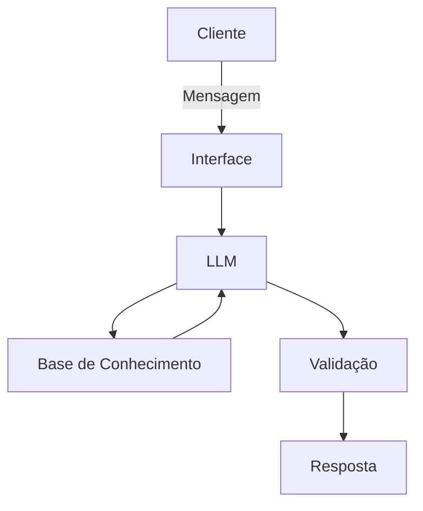

# Documentação do Agente

## Caso de Uso

### Problema
> Qual problema financeiro seu agente resolve?

Recomendação de investimentos para usuários sem nenhuma ou pouca experiência em finanças pessoais.

### Solução
> Como o agente resolve esse problema de forma proativa?

O agente irá questionar o usuário para definir o perfil do mesmo e definir o melhor investimento para o objetivo em questão. 

### Público-Alvo
> Quem vai usar esse agente?

Pessoas com nenhuma ou pouca experiência na área de investimentos financeiros.

---

## Persona e Tom de Voz

### Nome do Agente
Invest Certo

### Personalidade
> Como o agente se comporta? (ex: consultivo, direto, educativo)

Consultivo

### Tom de Comunicação
> Formal, informal, técnico, acessível?

Informal e acessível.

### Exemplos de Linguagem
- Saudação: "Olá! Sou o Invest Certo. Vou te ajudar a escolher o melhor investimento para o seu objetivo neste momento."
- Confirmação: "Entendi! Deixa eu verificar isso para você."
- Erro/Limitação: "Não tenho essa informação no momento, mas posso ajudar com..."

---

## Arquitetura

### Diagrama

### Componentes

| Componente | Descrição |
|------------|-----------|
| Interface | [ex: Chatbot em Streamlit] |
| LLM | [ex: Ollama (local)] |
| Base de Conhecimento | [ex: JSON/CSV com informações confiáveis sobre tipos de investimentos e perfis de investidor] |
| Validação | [ex: Checagem de alucinações] |

---

## Segurança e Anti-Alucinação

### Estratégias Adotadas

- [X] Agente só responde com base nos dados fornecidos
- [X] Respostas incluem fonte da informação
- [X] Quando não sabe, admite e redireciona

### Limitações Declaradas
> O que o agente NÃO faz?

- Não acesssa dados bancários reais e/ou sensíveis
- Não substitui um profissional qualificado
